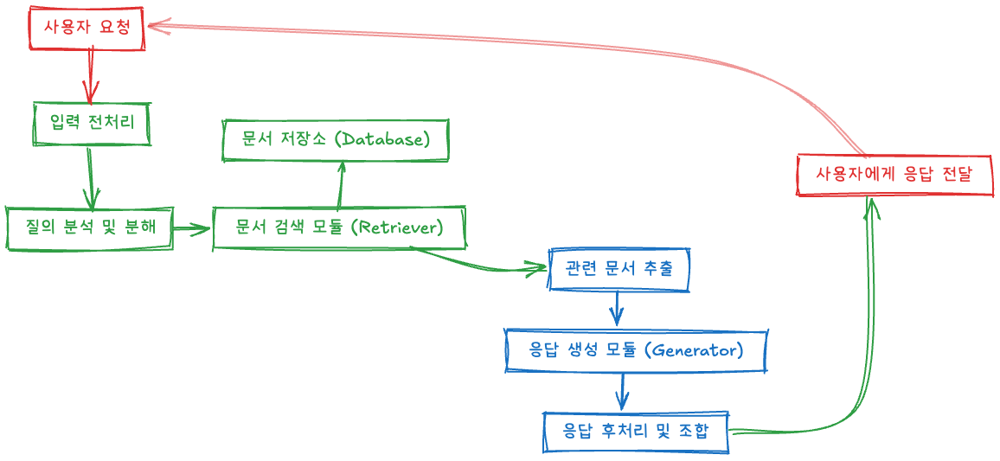

# 프로젝트 계획서

## 1. 목표

### 1.1 제목: ~시스템 개발

### 1.2 목표: 
본 과제는... 을 목표로 함.


## 2. 구성원 및 역할
(개인 프로젝트인 경우 역할 삭제)

- #### 이창준/cjLee-cmd/freestylelike@gmail.com
  - 프로젝트 관리

## 3. 개발 내용
### 3.1 주요 개발 내용


#### A. SW Flow
```mermaid
flowchart TD
    %% 사용자 입력 및 전처리 %%
    A[사용자 요청] -->|질문 입력| B[입력 전처리]
    B -->|토큰화, 정제| C[질의 분석]
    
    %% 문서 검색 %%
    C -->|쿼리 임베딩 생성| D[문서 검색]
    D -->|검색 실행| E[벡터DB (FAISS/Chroma)]
    E -->|유사 문서 검색| F[관련 문서 추출]
    
    %% LLM 응답 생성 %%
    F -->|프롬프트 생성| G[응답 생성 (GPT-4, Gemini)]
    G -->|최적 응답 생성| H[응답 후처리]
    
    %% 사용자 응답 전달 %%
    H -->|최종 응답 정제| I[사용자에게 전달]
    
    %% 문서 처리 %%
    subgraph 문서 처리 파이프라인
        J[PDF 문서]
        J -->|PyMuPDF/pdfplumber| K[PDF 로드]
        K -->|문서 조각화| L[텍스트 분할]
        L -->|벡터 변환| M[임베딩 생성]
        M -->|벡터DB 저장| E
    end
```
### B. 기능 정의



#### B.1 전체 기능

#### B.2 세부 기능

## 3. 결과물

결과물
